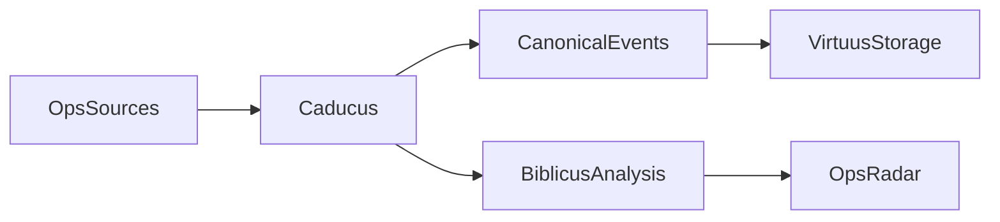

# Caducus

Caducus helps operations teams understand what is going wrong right now across logs, alerts, dead-letter queues, and other operational event streams.

It is a CLI-first system for collecting timestamped operational events, normalizing them into a canonical schema, storing them as plain JSON, and using semantic reinforcement memory to surface recurring patterns, fresh anomalies, and just-in-time context during incidents.

## Why Caducus Exists

Operational signals are scattered across many systems:

- CloudWatch logs
- alerting systems
- dead-letter queues
- notifications and incident messages

Each source captures part of the truth, but not the whole picture. Caducus is intended to bring those signals together into one stream of timestamped event records that can be analyzed as a living memory of operational behavior.

The goal is not just to search historical data. The goal is to create a radar for what looks unusual, active, or important now.

## How It Works

Caducus is designed around a simple flow:

1. Collect operational events from source systems.
2. Normalize them into canonical event records with text, timestamps, source identity, and generalized metadata.
3. Persist them as JSON files in a Virtuus-backed folder structure.
4. Analyze event groups using Biblicus reinforcement memory.
5. Surface patterns, anomalies, and context for operators.

This keeps the system inspectable and composable. The underlying data lives in plain folders, not inside a black-box database.

## CLI-First MVP

The initial product is a CLI utility.

The MVP is focused on a coherent end-to-end flow:

- collect events from operational sources
- store them in a canonical schema
- run analysis over selected event groups
- inspect recent events and analysis outputs from the command line

Initial source areas for the MVP are:

- CloudWatch Logs
- SQS dead-letter queues
- one alert source

Configuration is intended to be layered through YAML, environment variables, and CLI overrides. Caducus will own collection and orchestration while allowing Biblicus-related analysis settings to flow through the Caducus configuration tree without duplicating Biblicus's schema.

## Architecture At A Glance

Caducus is intentionally thin:

- **Caducus** handles collection, normalization, orchestration, and CLI workflows.
- **Virtuus** provides file-backed JSON storage and retrieval.
- **Biblicus** provides semantic reinforcement-memory analysis.

## Roadmap

Caducus is intended to grow beyond the initial CLI foundation over time.

Planned directions include:

- broader source integrations across operational systems
- deeper analysis of concepts and entities derived from operational activity
- richer incident context and root-cause workflows
- a future web UI and embeddable components for other applications

## Repository Direction

This repository is being built outside-in. Product definition and behavior specifications come first, followed by the minimum implementation needed to satisfy them.