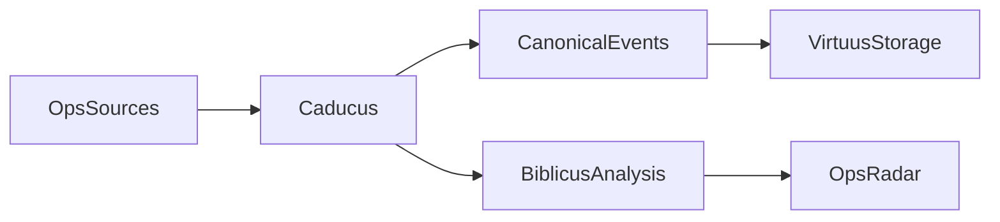

# Caducus

You have a huge pile of logs, and you need to decide what matters *right now*.

Caducus turns that pile into an operator radar: clustered issue blips that carry both frequency and recency signals so you can prioritize quickly.

- **Weight signal**: `hot`, `warm`, `cold`
- **Temporal signal**: `new`, `trending`, `known`

The current demo path is real and runnable end-to-end on HDFS log data.

## What This Looks Like

Raw logs are noisy:

```text
260316,115910,INFO,dfs.DataNode$DataXceiver,143,Receiving block blk_-1608999687919862906 src: /10.250.19.102:54106 dest: /10.250.19.102:50010
260316,115911,INFO,dfs.DataNode$PacketResponder,145,PacketResponder 1 for block blk_-1608999687919862906 terminating
260316,115911,INFO,dfs.FSNamesystem,35,BLOCK* NameSystem.allocateBlock: /mnt/hadoop/mapred/system/job_200811092030_0001/job.jar. blk_-1608999687919862906
```

Caducus normalizes these into canonical events, groups them, and runs reinforcement-memory analysis. The CLI then prints radar-ready topic lines:

```text
Group: hdfs-demo:dfs.DataNode$DataXceiver  Texts: 1821  Run: 6a013932-b9c4-457c-bc2d-d5ab26c96ece
  10, 10 251, 251  [weight=warm temporal=new]  n=1766
  10, 10 251, 251  [weight=warm temporal=new]  n=13
```

Interpretation:

- `weight` is recurrence/volume pressure (hot/warm/cold).
- `temporal` is recency state (new/trending/known).
- `n` is cluster member count.

In other words, each line is a blip on the radar with both intensity and freshness.

Top blips discovered in the current HDFS demo run:

- Block transfer surge (`Receiving block ...`) - about 1409 lines in this sample, surfaced in the dominant topic cluster.
- NameNode block allocation churn (`BLOCK* NameSystem.allocateBlock`) - about 472 lines.
- PacketResponder termination churn (`PacketResponder ... terminating`) - about 235 lines.

Signal legend used in the CLI:

- `weight`: `hot`, `warm`, `cold`
- `temporal`: `new`, `trending`, `known`

## Run The Working Demo

Install dependencies:

```bash
pip install -e ".[reinforcement-memory,dev]"
pip install datasets
```

Build a real HDFS subset and shift timestamps to a demo "now" so recency signals are meaningful:

```bash
python scripts/download_hdfs_demo.py \
  --output demo_data/hdfs_sample.csv \
  --max-rows 3000 \
  --anchor-now "2026-03-16T12:00:00Z"
```

Ingest and discover valid groups:

```bash
caducus demo ingest --input demo_data/hdfs_sample.csv --data-dir ./caducus-data
caducus groups --data-dir ./caducus-data
```

Run analysis for a discovered group:

```bash
caducus analyze --group-id 'hdfs-demo:dfs.DataNode$DataXceiver' --data-dir ./caducus-data
```

Or do ingest + analyze in one command:

```bash
caducus demo run --input demo_data/hdfs_sample.csv --group-id 'hdfs-demo:dfs.DataNode$DataXceiver' --data-dir ./caducus-data
```

### Notes

- Real HDFS group IDs are component-derived: `hdfs-demo:<component>`.
- Use single quotes around group IDs containing `$` in shell commands.
- `--anchor-now` preserves spacing between log rows while shifting them to your chosen clock anchor.

## How It Works

Caducus is intentionally thin:

- **Caducus** handles collection, normalization, orchestration, and CLI workflows.
- **Virtuus** provides file-backed JSON storage and retrieval.
- **Biblicus** provides semantic reinforcement-memory analysis.



## Releases

Caducus uses `python-semantic-release` with Conventional Commits.

Use commit messages like:

- `feat: add CloudWatch collector checkpointing`
- `fix: quote group IDs containing dollar signs in docs`
- `feat!: change canonical event schema`

Release behavior:

- `feat:` triggers a minor release
- `fix:` triggers a patch release
- `feat!:` or a `BREAKING CHANGE:` footer triggers a major release

The release workflow lives in `.github/workflows/release.yml` and runs on pushes to `main`. It will:

1. Determine the next version from commit messages.
2. Update `project.version` in `pyproject.toml` and `src/caducus/__init__.py`.
3. Generate `CHANGELOG.md`, create a tag, and create a GitHub Release.
4. Publish the built distributions to PyPI.

PyPI publishing is configured for GitHub Actions trusted publishing. Before the first live release, configure the `caducus` project on PyPI to trust this repository's `release.yml` workflow.

## Roadmap

Caducus is intended to grow beyond the initial CLI foundation over time.

Planned directions include:

- broader source integrations across operational systems
- deeper analysis of concepts and entities derived from operational activity
- richer incident context and root-cause workflows
- a future web UI and embeddable components for other applications

## Repository Direction

This repository is being built outside-in. Product definition and behavior specifications come first, followed by the minimum implementation needed to satisfy them.
