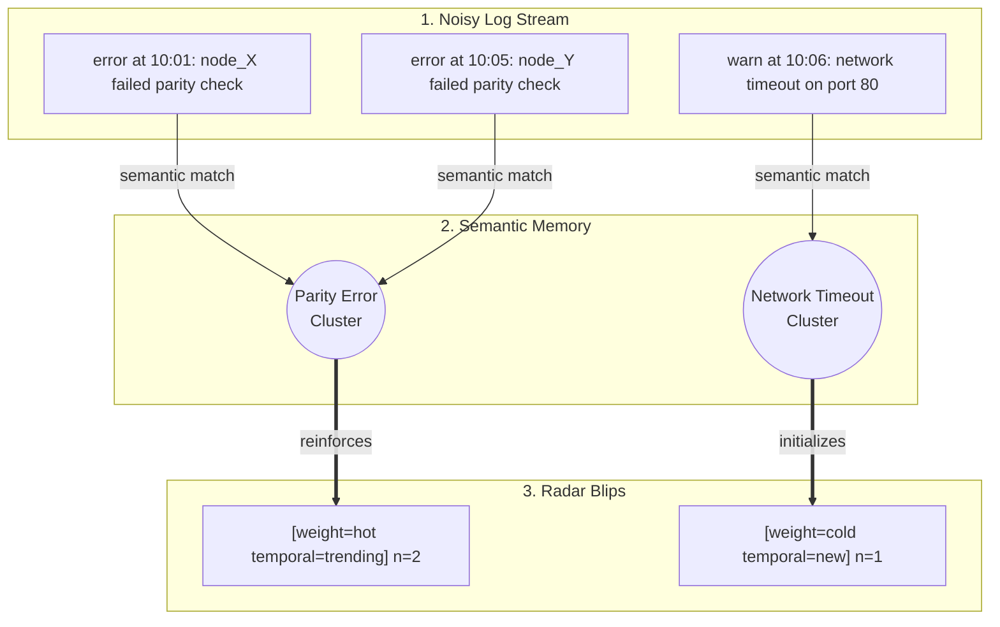
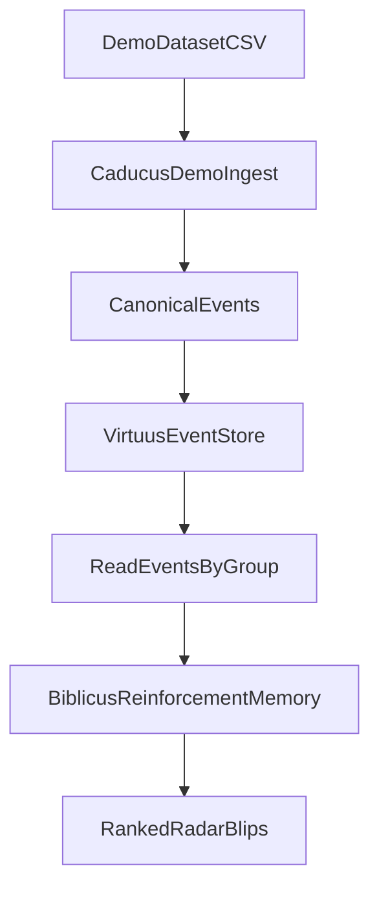

# Caducus

When the pager goes off, the problem is rarely "no data". The problem is too much data.

Caducus is built for that moment. It turns a flood of raw logs into a short, prioritized radar of issue blips so operators can decide what to investigate first.

What you get from the radar:

- **How intense is this issue?** `weight=hot|warm|cold`
- **How fresh is this issue?** `temporal=new|trending|known`
- **How big is this issue?** `n=<member_count>`

Instead of scanning thousands of lines manually, you get a ranked list of patterns with both frequency and recency signals.

## From Log Flood To Radar



Raw logs look like this:

```text
260316,115910,INFO,KERNEL,,instruction cache parity error corrected
260316,115911,INFO,KERNEL,,data cache parity error corrected
260316,115911,WARN,KERNEL,,torus receiver x+ input pipe error(s) detected and corrected
```

Caducus clusters those into radar-ready blips:

```text
Group: bgl-demo:KERNEL  Texts: 4983  Run: 899a6ffb-a5ea-47e1-b856-71ba8054cd74
   1. parity error, parity, instruction cache  [weight=warm temporal=known]  n=4827  (merged 97 clusters)
   2. mask, ce sym, sym  [weight=warm temporal=known]  n=114
   3. corrected, cache parity, parity error  [weight=warm temporal=known]  n=42
```

Read this as:

- `weight` is recurrence/volume pressure (hot/warm/cold).
- `temporal` is recency state (new/trending/known).
- `n` is cluster member count.

Top blips from a real BGL demo run:

- Repeated parity-error corrections in cache-related paths (dominant cluster).
- CE/SYM mask signaling bursts.
- Secondary corrected parity-error pattern cluster.

## Run The Working Demo

Install dependencies:

```bash
pip install -e ".[reinforcement-memory,dev]"
pip install datasets
```

Build a real BGL subset and shift timestamps to a demo "now" so recency signals are meaningful:

```bash
python scripts/download_hdfs_demo.py \
  --dataset bgl \
  --output demo_data/log_sample.csv \
  --max-rows 3000 \
  --anchor-now "2026-03-16T12:00:00Z"
```

Ingest and discover valid groups:

```bash
caducus demo ingest --input demo_data/log_sample.csv --data-dir ./caducus-data
caducus groups --data-dir ./caducus-data
```

Run analysis for a discovered group:

```bash
caducus analyze --group-id 'bgl-demo:KERNEL' --data-dir ./caducus-data
```

Or do ingest + analyze in one command:

```bash
caducus demo run --input demo_data/log_sample.csv --group-id 'bgl-demo:KERNEL' --data-dir ./caducus-data
```

### Notes

- Group IDs are source and component derived: `<source>:<component>` (for BGL demo this is usually `bgl-demo:KERNEL`).
- Use single quotes around group IDs containing `$` in shell commands.
- `--anchor-now` preserves spacing between log rows while shifting them to your chosen clock anchor.

## How It Works

Caducus is intentionally thin:

- **Caducus** handles collection, normalization, orchestration, and CLI workflows.
- **Virtuus** provides file-backed JSON storage and retrieval.
- **Biblicus** provides semantic reinforcement-memory analysis.



## Releases

Caducus uses `python-semantic-release` with Conventional Commits.

Use commit messages like:

- `feat: add CloudWatch collector checkpointing`
- `fix: quote group IDs containing dollar signs in docs`
- `feat!: change canonical event schema`

Release behavior:

- `feat:` triggers a minor release
- `fix:` triggers a patch release
- `feat!:` or a `BREAKING CHANGE:` footer triggers a major release

The release workflow lives in `.github/workflows/release.yml` and runs on pushes to `main`. It will:

1. Determine the next version from commit messages.
2. Update `project.version` in `pyproject.toml` and `src/caducus/__init__.py`.
3. Generate `CHANGELOG.md`, create a tag, and create a GitHub Release.
4. Publish the built distributions to PyPI.

PyPI publishing is configured for GitHub Actions trusted publishing. Before the first live release, configure the `caducus` project on PyPI to trust this repository's `release.yml` workflow.

## Roadmap

Caducus is intended to grow beyond the initial CLI foundation over time.

Planned directions include:

- broader source integrations across operational systems
- deeper analysis of concepts and entities derived from operational activity
- richer incident context and root-cause workflows
- a future web UI and embeddable components for other applications

## Repository Direction

This repository is being built outside-in. Product definition and behavior specifications come first, followed by the minimum implementation needed to satisfy them.
