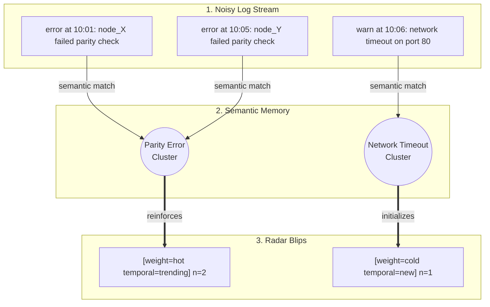
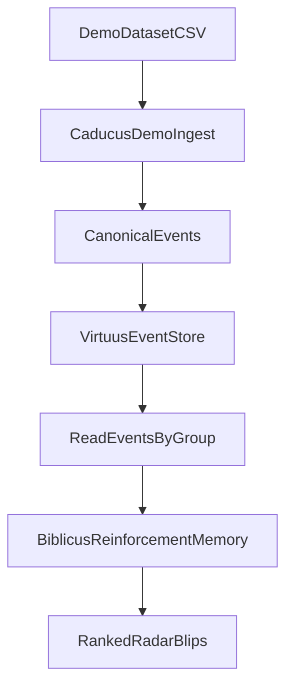

# Caducus

Caducus is for teams running production systems who need to spot important issues quickly in noisy operational data.

When the pager goes off, the problem is rarely "no data". The problem is too much data.

Caducus turns that flood of raw logs into a short, prioritized radar of issue blips so operators can decide what to investigate first.

What you get from the radar:

- **How intense is this issue?** `weight=hot|warm|cold`
- **How fresh is this issue?** `temporal=new|trending|known`
- **How big is this issue?** `n=<member_count>`

Instead of scanning thousands of lines manually, you get a ranked list of patterns with both frequency and recency signals.

## From Log Flood To Radar

Raw logs look like this - an overwhelming firehose:

```text
260316,115910,INFO,KERNEL,,instruction cache parity error corrected
260316,115911,INFO,KERNEL,,data cache parity error corrected
260316,115911,WARN,KERNEL,,torus receiver x+ input pipe error(s) detected and corrected
```

You have a magic "radar" device for telling you what's important in there and ranking it by priority. Caducus clusters those logs into radar-ready blips. Here's what you see on that radar:

```text
Group: bgl-demo:KERNEL  Texts: 4983  Run: 899a6ffb-a5ea-47e1-b856-71ba8054cd74
   1. parity error, parity, instruction cache  [weight=warm temporal=known]  n=4827  (merged 97 clusters)
   2. mask, ce sym, sym  [weight=warm temporal=known]  n=114
   3. corrected, cache parity, parity error  [weight=warm temporal=known]  n=42
```

Read this as:

- `weight` is recurrence/volume pressure (hot/warm/cold).
- `temporal` is recency state (new/trending/known).
- `n` is cluster member count.

In other words, each line is a blip on the radar with both intensity and freshness.

Top blips from a real supercomputer log dataset:

- Repeated parity-error corrections in cache-related paths (dominant cluster).
- CE/SYM mask signaling bursts.
- Secondary corrected parity-error pattern cluster.

### How it works conceptually



## Run The Working Demo

Install dependencies:

```bash
pip install -e ".[reinforcement-memory,dev]"
pip install datasets
```

Build a real-world log subset and shift timestamps to a demo "now" so recency signals are meaningful:

```bash
python scripts/download_hdfs_demo.py \
  --dataset bgl \
  --output demo_data/log_sample.csv \
  --max-rows 3000 \
  --anchor-now "2026-03-16T12:00:00Z"
```

Ingest and discover valid groups:

```bash
caducus demo ingest --input demo_data/log_sample.csv --data-dir ./caducus-data
caducus groups --data-dir ./caducus-data
```

Run analysis for a discovered group:

```bash
caducus analyze --group-id 'bgl-demo:KERNEL' --data-dir ./caducus-data
```

Or do ingest + analyze in one command:

```bash
caducus demo run --input demo_data/log_sample.csv --group-id 'bgl-demo:KERNEL' --data-dir ./caducus-data
```

### Notes

- Group IDs are source and component derived: `<source>:<component>` (for this demo it is `bgl-demo:KERNEL`).
- Use single quotes around group IDs containing `$` in shell commands.
- `--anchor-now` preserves spacing between log rows while shifting them to your chosen clock anchor.

## How It Works

Caducus is intentionally thin:

- **Caducus** handles collection, normalization, orchestration, and CLI workflows.
- **Virtuus** provides file-backed JSON storage and retrieval.
- **Biblicus** provides semantic reinforcement-memory analysis.



## Roadmap

- More collectors (CloudWatch/SQS/alerts) feeding canonical events
- Faster topic clustering and richer root-cause hints
- Minimal UI/embeds for operators to view radar blips

## Repository Direction

This repository is being built outside-in. Product definition and behavior specifications come first, followed by the minimum implementation needed to satisfy them.
